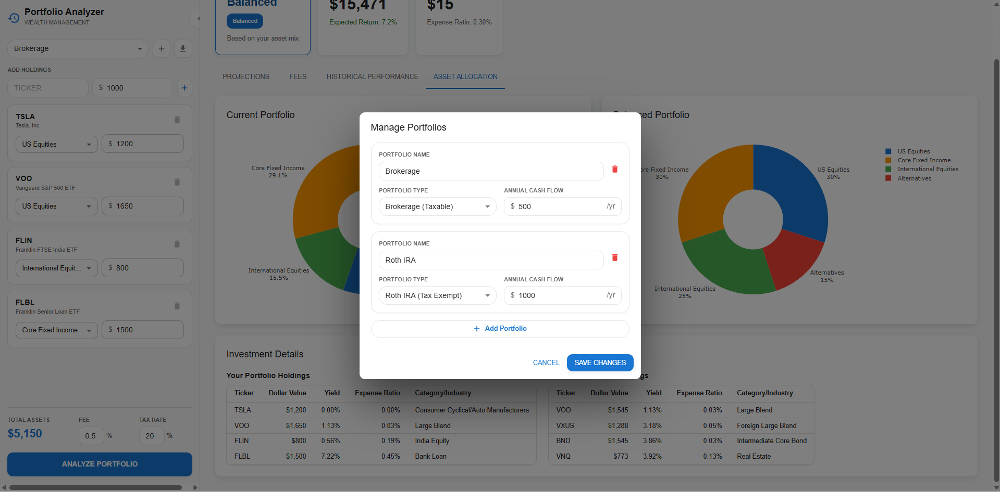

# Portfolio Analysis Web Application

A modern, professional financial portfolio analyzer built with **React**, **FastAPI**, and **yfinance**. This application helps investors compare their current holdings against optimized model portfolios, analyzing historical performance, projecting future returns, and quantifying fee impacts.

## 🕹️ Control Center (Left Panel)
The left panel serves as the main navigation and control hub for the application. It includes:
- **Portfolio Selector**: A dropdown to switch between your different accounts (Brokerage, Roth IRA, Traditional IRA) or view the **Aggregate Portfolio** (a combined view of all accounts).
- **Branding & Status**: Shows the total value of the selected portfolio and the overall target risk profile.
- **Global Settings**: Manage the global tax rate applied to all taxable accounts.
- **Holdings Input**: Add new investments by ticker symbol and assign dollar values.

## 📂 Portfolio Management
Easily manage multiple accounts and set account-specific parameters to ensure accurate tax and cash flow projections.

- **Multiple Account Types**: Support for Brokerage (taxable), Roth IRA (tax-free), and Traditional IRA (tax-deferred).
- **Annual Cash Flows**: Set recurring contributions or withdrawals for each specific account.
- **Persistence**: Your portfolio configurations stay active during your session.

## 🔗 E*TRADE Integration
Import your real-world data directly from your brokerage account for instant analysis.

- **Secure OAuth Connection**: Connect your E*TRADE account safely.
- **Automatic Sync**: Pull holdings, quantities, and current values automatically.
- **Unified Analysis**: Combine imported E*TRADE accounts with manual portfolios for a complete financial picture.

## 📈 10-Year Projections
Visualize the long-term growth potential of your strategy compared to optimized models.

*The interactive chart shows the growth trajectory of your current holdings vs. a recommended model portfolio.*

*Detailed year-by-year breakdown showing the exact impact of growth, taxes, fees, and cash flows on your balance.*

## 💰 Fee Impact Analysis
Understand the hidden costs of your investments and find ways to save.

- **Expense Ratios & Advisory Fees**: See a full breakdown of what you're paying.
- **Savings Potential**: Quantify how much more wealth you could accumulate by reducing fees over 10 years.
- **Manager Fees**: Analysis of the weighted average expense ratio of your underlying fund selections.

## ⏳ Historical Performance
Look back at how your current portfolio would have performed during past market conditions (2015-2025).

- **Risk-Adjusted Metrics**: View your Sharpe Ratio, Volatility, and Max Drawdown.
- **Total vs. Annualized Return**: Compare your strategy's efficiency against standard benchmarks.

## 🍰 Asset Allocation
Compare your current diversification against professional standards.

- **Current vs. Model**: Side-by-side pie charts showing where your money is invested across US Equities, International Equities, Fixed Income, and Alternatives.
- **Holdings Yields**: See the weighted average dividend yield of your portfolio.
- **Asset Class Overrides**: Manually re-classify tickers if the automatic detection doesn't match your specific needs.

---
*Disclaimer: For informational purposes only. Past performance does not guarantee future results.*
