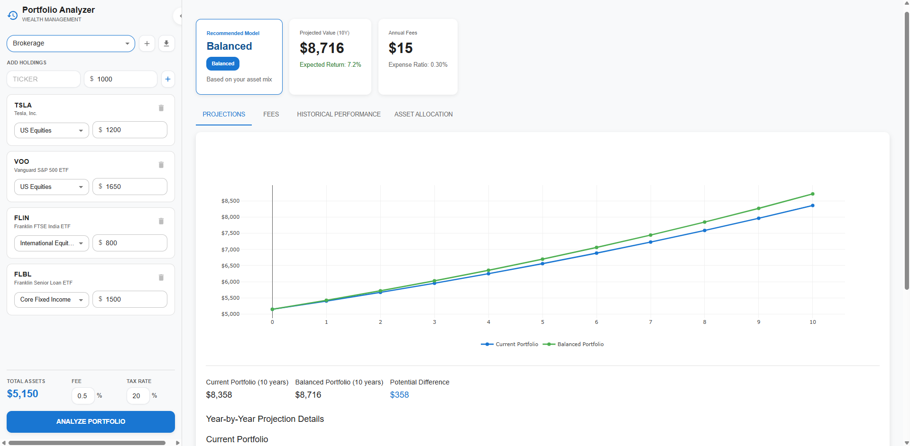
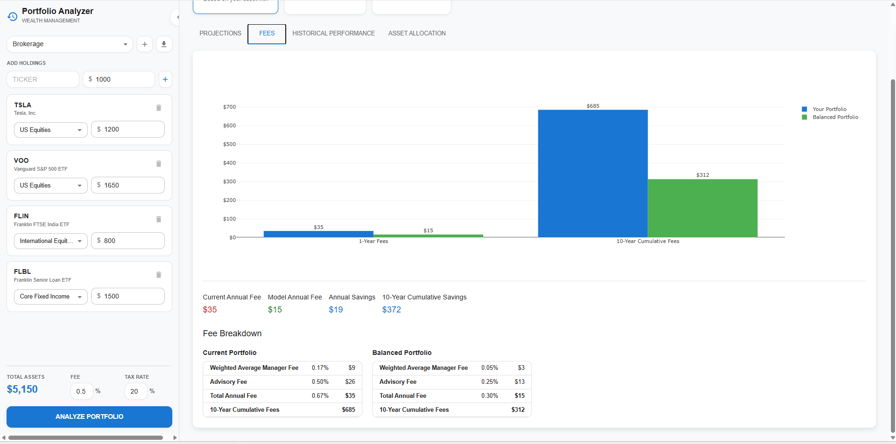
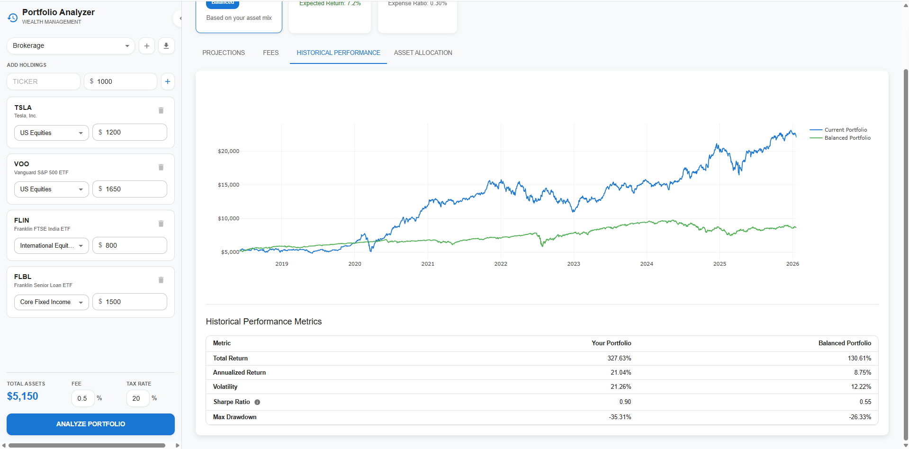

# Portfolio Analysis Web Application

A modern, professional financial portfolio analyzer built with **React**, **FastAPI**, and **yfinance**. This application helps investors compare their current holdings against optimized model portfolios, analyzing historical performance, projecting future returns, and quantifying fee impacts.

## 🚀 Live Preview

## ✨ Core Features

### 📊 Comprehensive Analysis
- **Aggregate Portfolio View**: Combine multiple accounts (Brokerage, Roth, Traditional IRA) into a single unified analysis.
- **Tax-Aware Projections**: Accurate 10-year growth scenarios that account for specific tax treatments:
  - **Brokerage**: Taxes applied to yearly gains.
  - **Roth IRA**: Tax-free accumulation and withdrawal.
  - **Traditional IRA**: Tax-deferred tracking with estimated liability.
- **Monte Carlo Simulations**: Future returns projected using asset-class specific growth rates and volatility.

### 💰 Fee Impact Tracking
- **Fee Comparison**: Side-by-side analysis of advisory fees and expense ratios.
- **Savings Calculator**: Calculate potential 10-year cumulative savings by switching to optimized low-cost models.
- **Daily Compounding**: Fees are deducted daily to match real-world investment behavior.

### 📈 Historical & Allocation
- **Historical Backtesting**: Real market data from 2015-2025 showing returns, volatility, Sharpe ratio, and Max Drawdown.
- **Asset Allocation**: Interactive pie charts for current vs. recommended allocations.
- **Model Matching**: Automatically matches your risk profile to one of 5 optimized models (Conservative to Aggressive).

## 🛠 Tech Stack
- **Frontend**: React 18, TypeScript, Material UI (MUI), Plotly.js
- **Backend**: FastAPI (Python 3.11), Uvicorn
- **Analytics**: Pandas, NumPy, yfinance (Yahoo Finance API)

## 📸 Interface

### Main Dashboard & Analysis

*Compare growth trajectories across different portfolio strategies.*

### Fee Breakdown

*Visualize the long-term impact of advisory fees and expense ratios.*

### Historical Performance

*Detailed risk-adjusted metrics using actual historical market data.*

## ⚙️ How to Use
1. **Add Portfolios**: Create multiple accounts (Brokerage, IRA) in the management modal.
2. **Input Holdings**: Enter tickers (e.g., VOO, BND) and dollar amounts.
3. **Set Tax Rates**: Adjust your global tax rate and per-portfolio cash flows.
4. **Analyze**: Get instant recommendations and professional-grade financial charts.

---
*Disclaimer: For informational purposes only. Past performance does not guarantee future results.*
